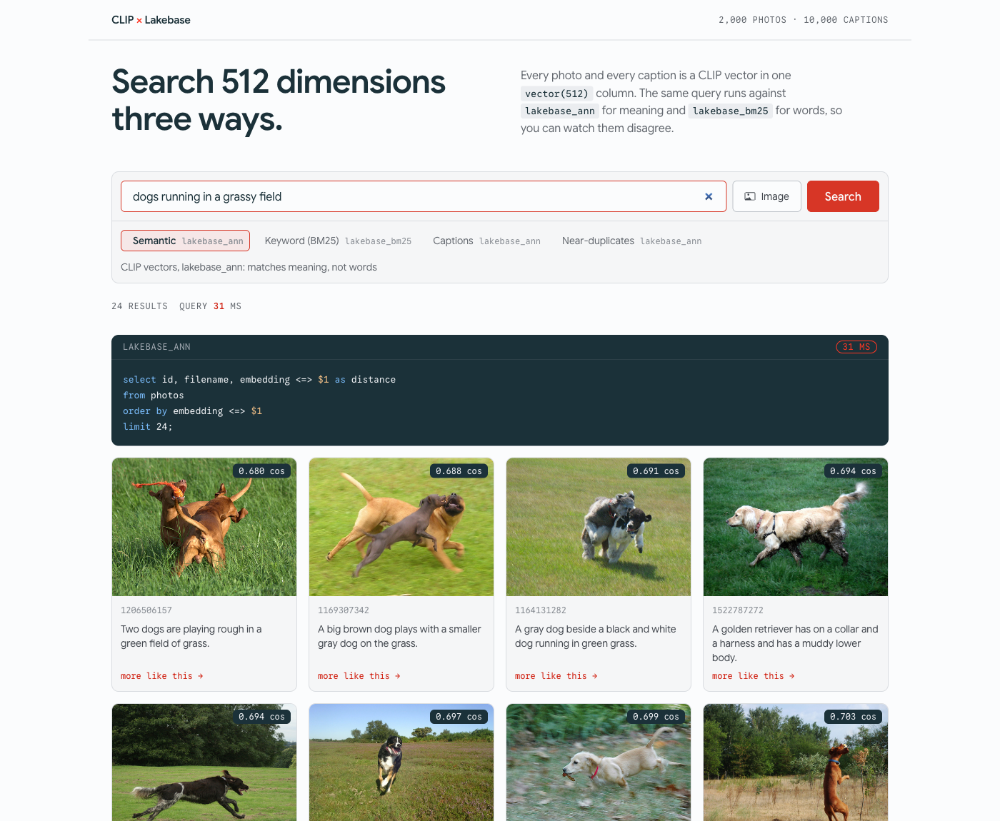
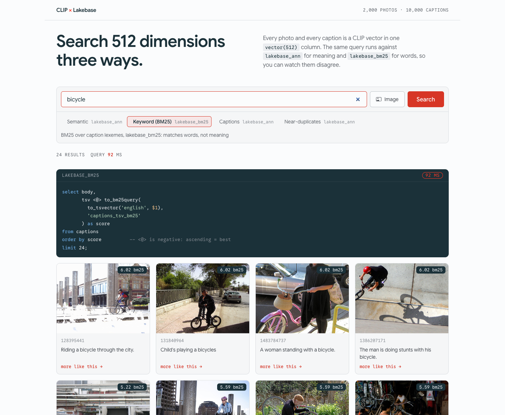
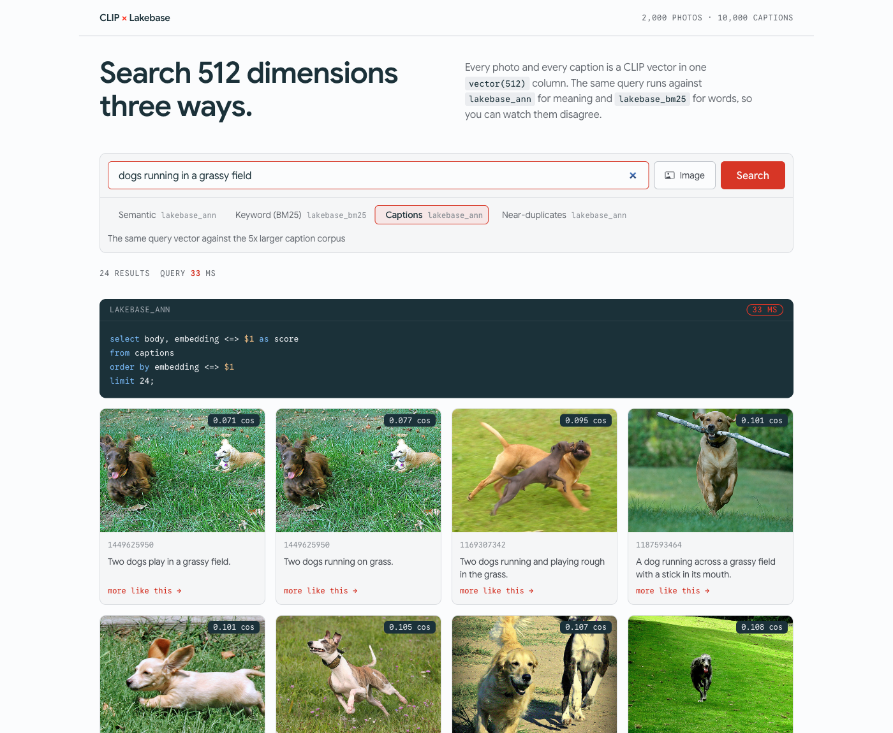
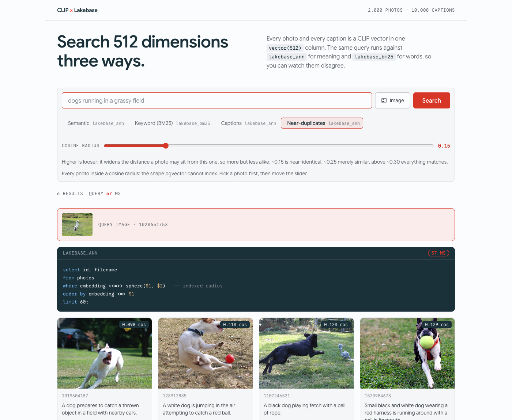

# Image search over CLIP embeddings with Lakebase Search

<p>
  Search 2,000 <a href="https://huggingface.co/datasets/nlphuji/flickr30k">Flickr30k</a> photos by meaning, by words, or by image. One <code>vector(512)</code> column, three Lakebase indexes, on Neon Postgres.
</p>

&rarr; https://neon-demo-lakebase-search-clip-embeddings.vercel.app

<p>
  <a href="#introduction"><strong>Introduction</strong></a> ·
  <a href="#try-it"><strong>Try it</strong></a> ·
  <a href="#the-three-query-shapes"><strong>Query shapes</strong></a> ·
  <a href="#setting-up-locally"><strong>Setting up locally</strong></a> ·
  <a href="#things-worth-knowing"><strong>Things worth knowing</strong></a> ·
  <a href="#tech-stack"><strong>Tech stack</strong></a>
</p>

## Introduction

The corpus is [nlphuji/flickr30k](https://huggingface.co/datasets/nlphuji/flickr30k), 31,014 photos with five human-written
captions each. Every photo and every caption in it becomes a CLIP vector stored
in one `vector(512)` column. The same query runs against `lakebase_ann` for meaning and
`lakebase_bm25` for words, so you can watch the two disagree on the same input.

CLIP encodes images and text into the same 512-dimension space. Once you hold a
vector, it makes no difference which encoder produced it, so searching by text
and searching by image run identical SQL.

## Try it

### Semantic

Ranks photos by cosine distance against `lakebase_ann`. It matches on meaning,
so a photo can rank highly even when its caption shares no word with the query.

[**dogs running in a grassy field**](https://neon-demo-lakebase-search-clip-embeddings.vercel.app/?q=dogs+running+in+a+grassy+field&mode=semantic)



### Keyword (BM25)

The same corpus through `lakebase_bm25`, which scores lexemes rather than
meaning. Running the same words in both modes shows where the two rankings
diverge.

[**bicycle**](https://neon-demo-lakebase-search-clip-embeddings.vercel.app/?q=bicycle&mode=keyword)



### Captions

The same query vector against the five times larger caption corpus, so you see
how the model describes a scene rather than which photo it picks.

[**dogs running in a grassy field**](https://neon-demo-lakebase-search-clip-embeddings.vercel.app/?q=dogs+running+in+a+grassy+field&mode=captions)



### Near-duplicates

Every photo inside a cosine radius of a given photo. This is the query shape
pgvector cannot answer from an index, and it needs a photo rather than a phrase.
Drag the slider to widen the band.

[**near-duplicates of this dog at 0.15**](https://neon-demo-lakebase-search-clip-embeddings.vercel.app/?photo=1020651753&mode=radius&radius=0.15)



## The three query shapes

Two access methods, built after the data is loaded:

```sql
create index photos_embedding_ann on photos
using lakebase_ann (embedding vector_cosine_ops)
with (build_mode = 'standard');

create index captions_tsv_bm25 on captions
using lakebase_bm25 (tsv tsvector_bm25_ops)
with (k1 = 1.2, b = 0.75);
```

Build them in that order. An ANN index created on an empty table has no
partitions to probe, and BM25 scoring depends on corpus-wide document-length
statistics.

**Top-k nearest neighbour.** Identical to what you would write against
pgvector's HNSW or IVF. Swapping the index type changes the plan and the recall,
not the query.

```sql
select id, filename, embedding <=> $1 as distance
from photos order by embedding <=> $1 limit 24;
```

**Radius.** `WHERE embedding <=> $1 < 0.2` against pgvector is a filter: the
index sorts by distance and cannot seek by it, so you scan the table.
`lakebase_ann` registers `<<=>>` as a strategy on `vector_cosine_ops`, so the
bound is pushed into the index and only the matching region is read.

```sql
select id, filename from photos
where embedding <<=>> sphere($1, $2)   -- indexed radius
order by embedding <=> $1 limit 60;
```

**BM25.** Note that `to_bm25query` takes the index name as an argument, because
scoring needs that index's corpus statistics. A plain `tsvector @@ tsquery`
match has no equivalent, since it knows nothing about the corpus. `<@>` returns
a negative score, so ascending order is most relevant first.

```sql
select body, tsv <@> to_bm25query(to_tsvector('english', $1), 'captions_tsv_bm25') as score
from captions order by score limit 24;
```

All of this sits in [`src/lakebase/`](src/lakebase/), four files of about 350
lines with [their own README](src/lakebase/README.md). The rest of the repo is
application code that never touches the indexes.

## Deploy your own

Requires a Neon project with `lakebase_vector` and `lakebase_text` enabled, plus
Neon Storage for the images.

[](https://vercel.com/new/clone?repository-url=https://github.com/rishi-raj-jain/clip-image-search)

Set `DATABASE_URL`, `AWS_ENDPOINT_URL_S3`, `AWS_ACCESS_KEY_ID`,
`AWS_SECRET_ACCESS_KEY`, `AWS_REGION` and `S3_BUCKET`, then run `npm run setup`
against the same database before the first request.

## Setting up locally

Node 22 or newer.

```bash
npm install
cp .env.example .env      # DATABASE_URL + the Neon Storage keys
npm run setup             # pull, embed, schema, load, index, warm
npm run dev
```

`npm run setup` defaults to 2,000 photos, which is enough to see every query
shape work and takes about five minutes on a laptop. For the full 31,014:

```bash
npm run dataset:pull -- --limit all
npm run dataset:embed
npm run dataset:load
npm run db:index -- --drop
```

Each step skips work it has already done, so you can re-run any of them after a
failed download or an interrupted session.

### The scripts

| Command                         | What it does                                                                                               |
| ------------------------------- | ---------------------------------------------------------------------------------------------------------- |
| `npm run dataset:pull`          | [Flickr30k](https://huggingface.co/datasets/nlphuji/flickr30k) into Neon Storage and `data/metadata.jsonl` |
| `npm run dataset:embed`         | CLIP over images and captions                                                                              |
| `npm run db:schema`             | Creates the tables, idempotent                                                                             |
| `npm run dataset:load`          | Embeddings into Postgres over one connection                                                               |
| `npm run db:index`              | Builds the three Lakebase indexes                                                                          |
| `npm run db:stats`              | Partition layout, index sizes, current GUCs                                                                |
| `npm run db:warm`               | Precomputes embeddings for the default queries                                                             |
| `npm run query -- --text "..."` | Every query shape, from the terminal                                                                       |

## Tech stack

- [Next.js 16](https://nextjs.org) with the App Router, one client island and three route handlers
- [Neon Postgres 18](https://neon.tech) with `lakebase_vector` and `lakebase_text`
- [`@neondatabase/serverless`](https://github.com/neondatabase/serverless) over HTTP, no ORM
- [CLIP ViT-B/32](https://huggingface.co/Xenova/clip-vit-base-patch32) through [transformers.js](https://github.com/huggingface/transformers.js)
- [Neon Storage](https://neon.tech) for the images, signed with [aws4fetch](https://github.com/mhart/aws4fetch)
- [Tailwind CSS v4](https://tailwindcss.com)

## License

MIT
